# 🩸 Blood Bank Management System

A modern, full-stack web application to efficiently manage blood donations, users, and staff with real-time data and role-based access. Built with a robust backend and a responsive React frontend using Vite. 🚀

---

## 🚦 Tech Stack

  
  
  
  
  
  
  

---

## ✨ Features

- 🩸 **Blood Donation Management**: Manage donors, approvals, and rejections.
- 🔒 **Role-based Authentication**: Admin, staff, and donor roles with secure JWT login.
- 📊 **Dashboard**: Role-specific dashboards with stats on donors, blood groups, and staff.
- 📋 **User Management**: Add, update, and remove staff and donors securely.
- 📁 **Data Export**: Export donor and staff data as CSV files.
- 👩‍💻 **Responsive UI**: Clean and modern interface optimized for desktop and mobile.
- 🔍 **Search & Filter**: Quickly locate donors and staff.
- 🛠️ **Real-time updates and validations** throughout the system.

---

## 📂 Folder Structure

BloodBank-management-system/
backend/ # Node.js, Express, MongoDB API
frontend/ # React, Vite, MUI frontend

---

## 🚀 Getting Started

### 1. Clone the repository

git clone https://github.com/madhan404/BloodBank-management-system.git
cd BloodBank-management-system

### 2. Setup Backend

cd backend
npm install
npm start

#### 2.1 Configure Environment Variables

Create a `.env` file and set:

PORT=3000
MONGODB_URI=mongodb://localhost:27017/bloodbank
JWT_SECRET=your_jwt_secret_key
FRONTEND_URL=http://localhost:5173

### 3. Setup Frontend

cd frontend
npm install
npm run dev

The backend runs on `http://localhost:3000` and the frontend on `http://localhost:5173` by default.

---

## 🖼️ Screenshots

### Home Page 

### Home Page
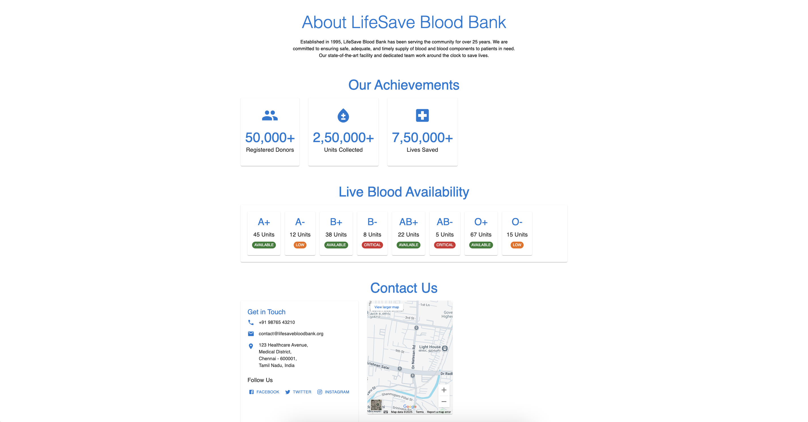

### Donor registeration
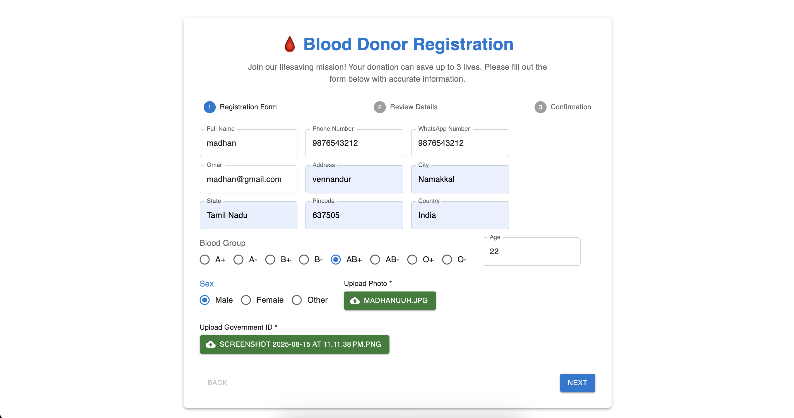

### registeration checking Page
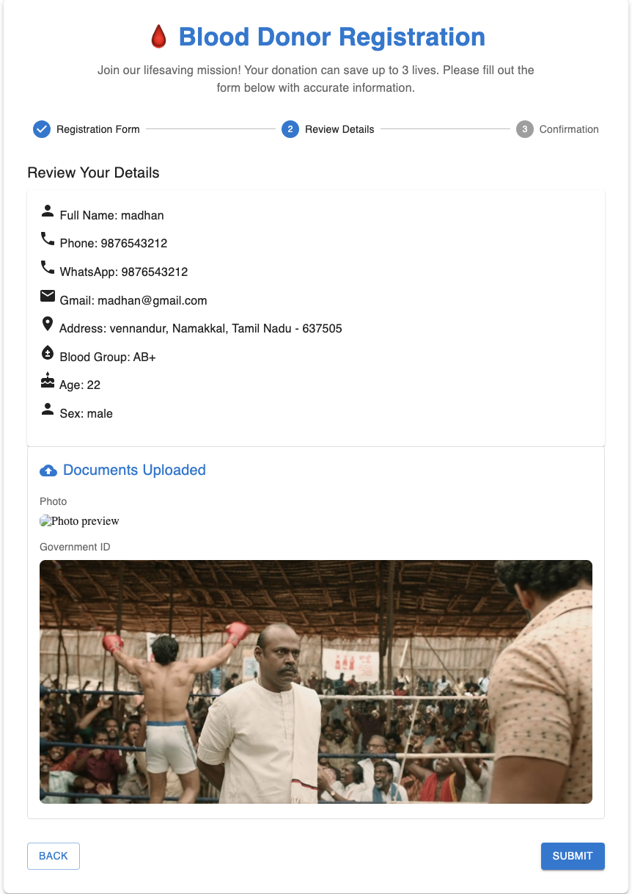

### registered Success
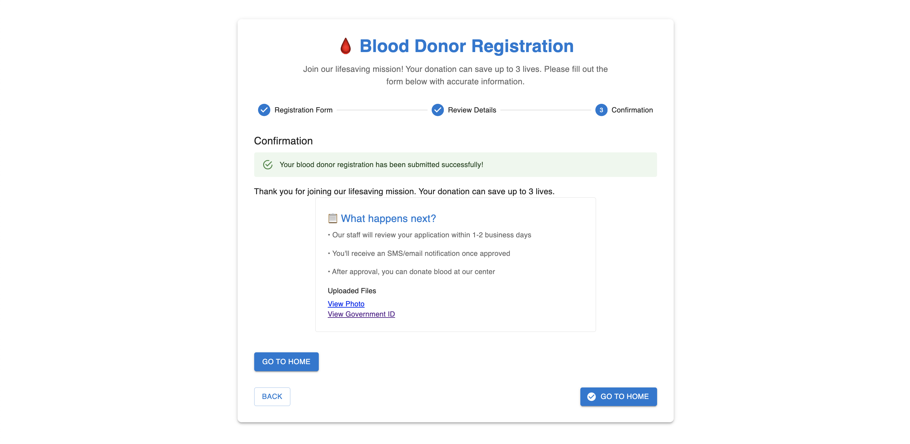

### Login Page
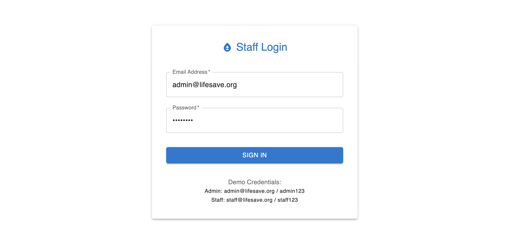

### Staff - Pending Approvals
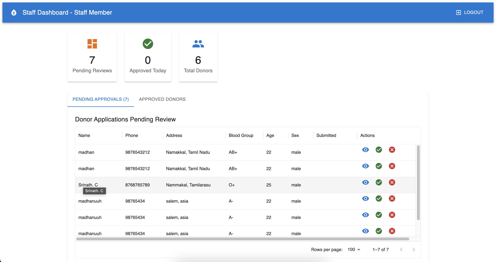

### Staff - Approved Donors
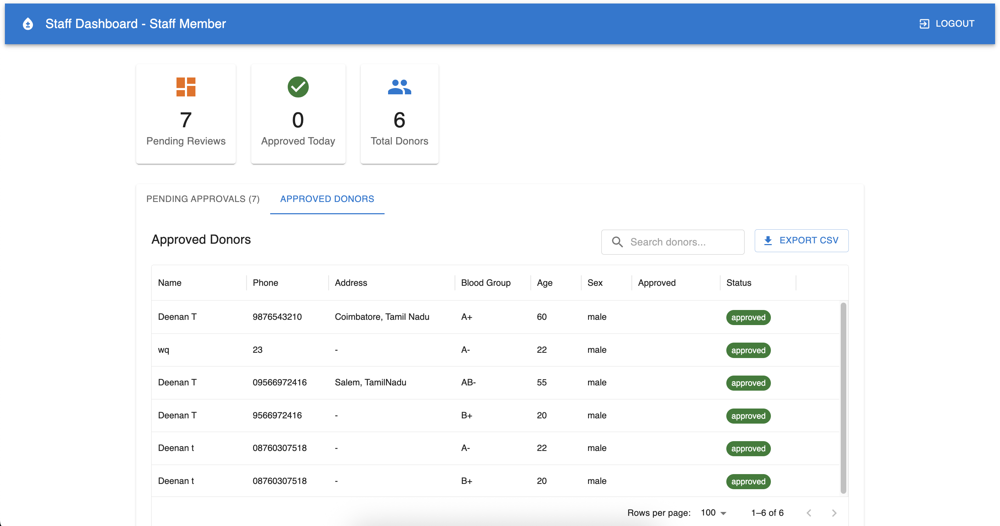

### Staff Dashboard - view applications
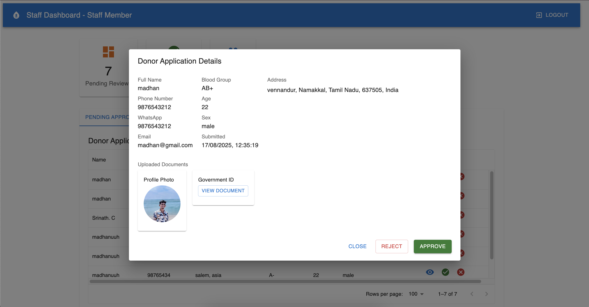

### Admin - Staff Management
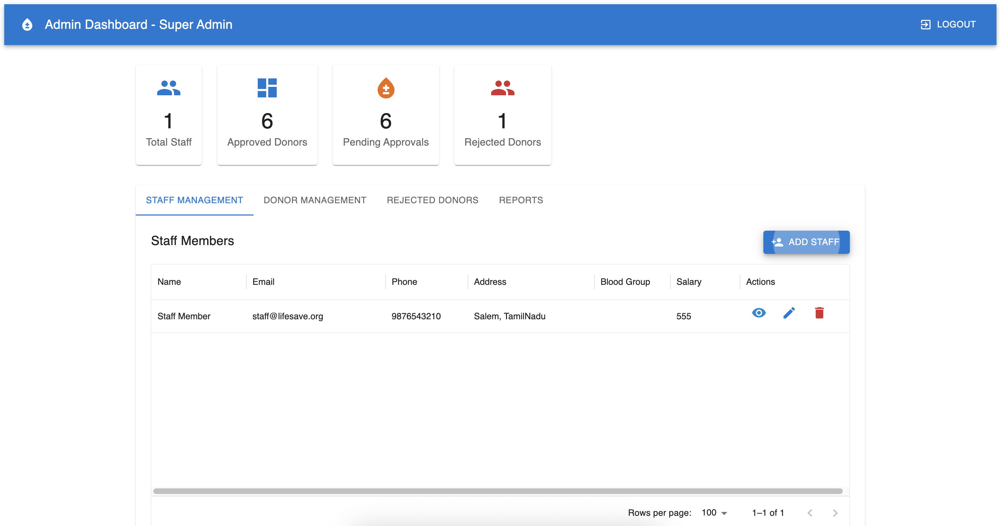

### Admin - Add Staff
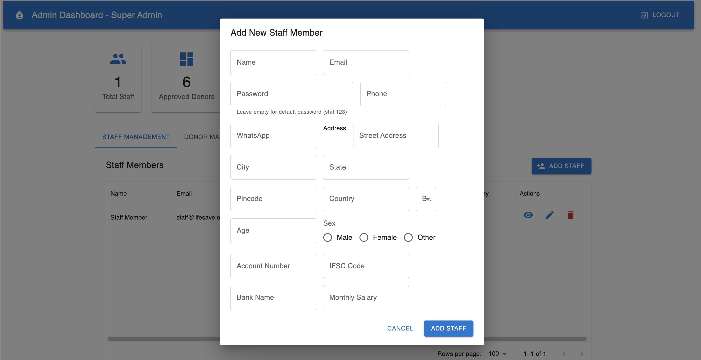

### Admin - Donor Management

### Admin - rejected-donor1
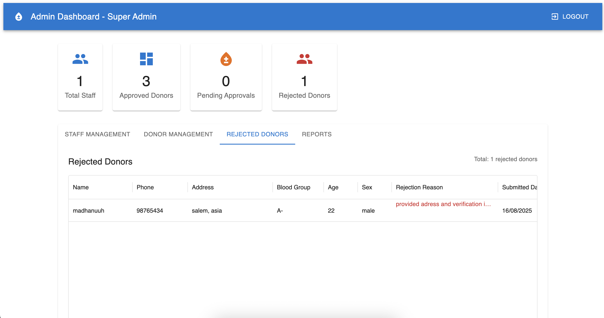

### Admin - rejected-donor2
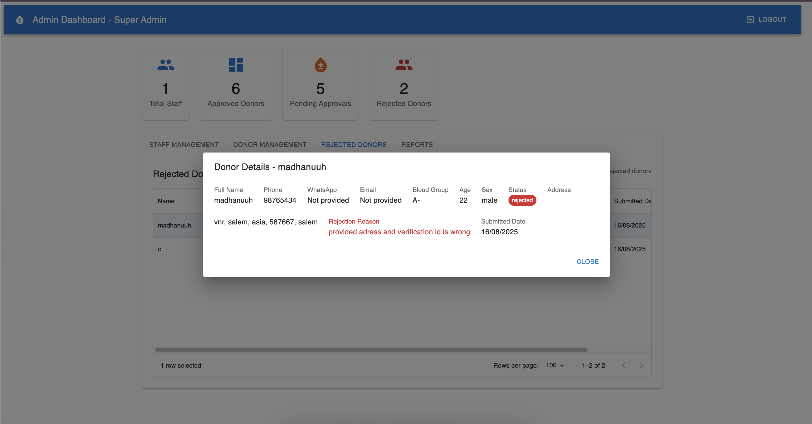

### Admin - reports
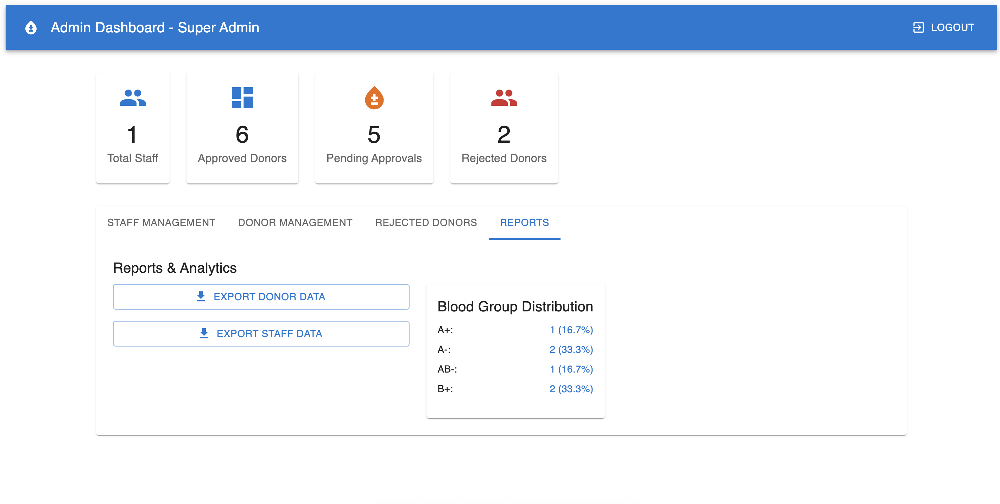

---

## 🤝 Contributing

Pull requests are welcome! For major changes, please open an issue first to discuss what you would like to change.

---

## 📄 License

This project is licensed under the MIT License. See the [LICENSE](LICENSE) file for details.

---

## 🙋‍♂️ Contact

Created by [Madhanraj S](https://github.com/madhan404) and [Deenan T](https://github.com/Dee2909) — feel free to reach out!

---

## ❤️ Live preview

[https://bloodbank-portal.netlify.app](https://bloodbank-portal.netlify.app)

<!-- Production only, use localhost for local dev -->